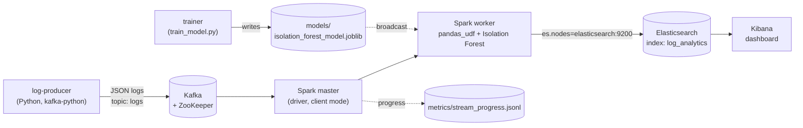
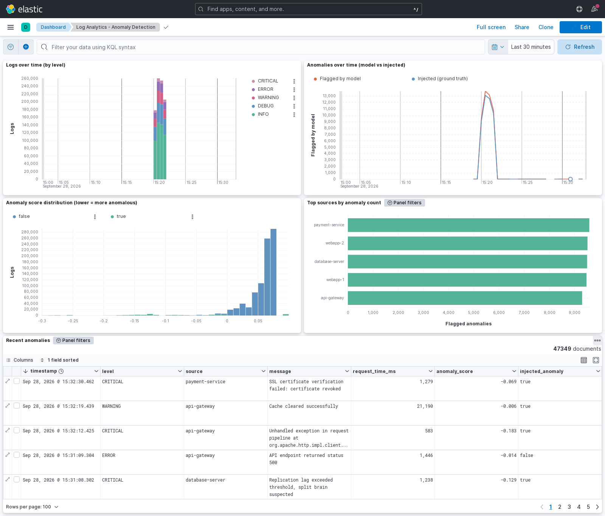

# Real-Time Log Analytics Platform for Anomaly Detection

A streaming pipeline that generates application logs, scores every log with an
Isolation Forest model in Spark Structured Streaming, and indexes the results in
Elasticsearch for exploration in a Kibana dashboard. Everything runs in Docker Compose.

- **Producer** (`log_producer.py`): emits realistic JSON logs to Kafka. A configurable
  fraction (`ANOMALY_RATE`, default 5%) are injected anomalies: latency spikes, rare
  error messages, and unusually long or short messages. Every log carries a boolean
  `injected_anomaly` field as ground truth.
- **Model** (`train_model.py`): Isolation Forest on TF-IDF(message) + scaled
  `request_time_ms` and `message_length`. It is trained on logs from the producer's own
  generator and evaluated against `injected_anomaly` on a held-out test set.
- **Stream processor** (`spark_processor.py`): reads Kafka, scores each micro-batch with
  a vectorized `pandas_udf`, and writes `is_anomaly` and `anomaly_score` to the
  `log_analytics` index in Elasticsearch.
- **Dashboard** (`kibana/dashboard.ndjson`): data view plus a dashboard with logs over
  time, anomalies over time, anomaly score distribution, top sources by anomaly count,
  and a table of recent anomalies.

## Architecture



## Tech stack

| Component | Version |
|---|---|
| Kafka / ZooKeeper | Confluent Platform 7.3.0 |
| Spark | 3.3.1 (`bitnamilegacy/spark:3.3.1` + Python libs, see `spark/Dockerfile`) |
| Spark connectors | `spark-sql-kafka-0-10_2.12:3.3.1`, `elasticsearch-spark-30_2.12:8.5.0` |
| Elasticsearch / Kibana | 8.5.0 |
| Python (Spark image, trainer) | 3.8 |
| Python (producer) | 3.9, `kafka-python` 3.0.11 |
| ML | scikit-learn 1.3.2, numpy 1.24.4, scipy 1.10.1, joblib 1.4.2, pandas 1.5.3, pyarrow 10.0.1 |

The training environment (`requirements-train.txt`) and the Spark image
(`spark/requirements-spark.txt`) pin the same numpy, scikit-learn, scipy and joblib
versions on the same Python minor version, so the pickled model loads in Spark.

> `bitnami/spark:3.3.1` was removed from Docker Hub when Bitnami retired its public
> catalog in 2025. The identical image is still published as `bitnamilegacy/spark:3.3.1`,
> which is what `spark/Dockerfile` builds on.

## Project layout

```
.
├── docker-compose.yml          # full stack + one-off "trainer" service (profile: tools)
├── Dockerfile                  # log producer image
├── Dockerfile.train            # training image (Python 3.8, pinned ML libs)
├── log_producer.py             # log generator + Kafka producer
├── train_model.py              # dataset generation, training, evaluation
├── spark_processor.py          # Spark Structured Streaming job
├── spark/Dockerfile            # custom Spark image with numpy/sklearn/pandas/pyarrow
├── kibana/dashboard.ndjson     # exported data view + dashboard
├── scripts/
│   ├── submit_spark_job.sh     # spark-submit against spark://spark-master:7077
│   ├── import_kibana.sh        # import the dashboard via the saved objects API
│   └── test_spark_es_connection.py  # standalone Spark -> Elasticsearch write test
├── models/                     # trained model (generated)
├── metrics/                    # model_metrics.json, stream_progress.jsonl
└── docs/kibana_dashboard.png
```

## Running it

Prerequisites: Docker with Compose v2, a Bash shell (on Windows, Git Bash), `curl`,
and about 6 GB of RAM for Docker.

**1. Build the images and train the model** (writes `models/isolation_forest_model.joblib`
and `metrics/model_metrics.json`):

```bash
docker compose --profile tools build
docker compose run --rm trainer
```

**2. Start the stack.** The producer starts sending one log per second once Kafka is healthy.

```bash
docker compose up -d
docker compose ps
```

**3. Submit the Spark job.** It runs in the foreground, so use a separate terminal. The first
run downloads the Kafka and Elasticsearch connector jars. At startup the job installs an
index template that maps `timestamp` as `date` (es-hadoop sends timestamps as epoch millis).

```bash
./scripts/submit_spark_job.sh
```

**4. Import the Kibana dashboard** once some documents have been indexed (the data view
needs the index to exist to show fields):

```bash
curl -s "localhost:9200/log_analytics/_count"
./scripts/import_kibana.sh
```

**5. Open Kibana:** <http://localhost:5601/app/dashboards#/view/log-analytics-dashboard>

Other UIs: Spark master <http://localhost:8080>, Spark job <http://localhost:4040>.

Check that anomalies are reaching Elasticsearch:

```bash
curl -s "localhost:9200/log_analytics/_search?q=is_anomaly:1&size=3&sort=timestamp:desc&pretty"
```

### Producer configuration

| Variable | Default | Meaning |
|---|---|---|
| `KAFKA_BROKER` | `localhost:9092` (`kafka:29092` in compose) | bootstrap server |
| `KAFKA_TOPIC` | `logs` | topic |
| `MESSAGE_DELAY` | `1` | seconds between messages; `0` = burst mode |
| `ANOMALY_RATE` | `0.05` | fraction of injected anomalies |
| `MESSAGE_COUNT` / `--count` | `0` (forever) | stop after N messages |

Burst mode (`--burst` or `MESSAGE_DELAY=0`) batches with `linger_ms=20` and
`batch_size=256 KB` and reports events/sec instead of printing each log:

```bash
docker compose run --rm log-producer python log_producer.py --burst --count 500000
```

### Spark job configuration

`scripts/submit_spark_job.sh` passes these through as environment variables:
`STARTING_OFFSETS` (`latest`), `TRIGGER_INTERVAL` (`5 seconds`) and
`MAX_OFFSETS_PER_TRIGGER` (unset). The checkpoint lives in `./checkpoints` (bind-mounted).
Micro-batch progress (`inputRowsPerSecond`, `processedRowsPerSecond`) is appended to
`metrics/stream_progress.jsonl`.

## Results

All numbers below were measured on this machine:

| | |
|---|---|
| CPU | AMD Ryzen 5 4600H (6 cores / 12 threads) |
| RAM | 15.4 GB (Docker Desktop WSL2 VM: 12 vCPUs, 7.4 GiB) |
| OS | Windows 11 Home 10.0.26200, Docker Engine 29.6.1 |
| Spark cluster | 1 master + 1 worker, job limited to 4 cores, 1 GB executor memory |
| Date | 2026-09-28 |

### Model quality (held-out test set)

From `docker compose run --rm trainer` (`metrics/model_metrics.json`): 20,000 generated logs,
75/25 stratified split, 5% injected anomalies, `contamination=0.05`. Positive class = injected anomaly.

| Metric | Value |
|---|---|
| Precision | **0.833** |
| Recall | **0.864** |
| F1 | **0.848** |

Confusion matrix on the 5,000-log test set:

| | predicted normal | predicted anomaly |
|---|---|---|
| **normal** | 4,716 | 42 |
| **anomaly** | 33 | 209 |

Recall by anomaly type: rare error messages 1.00, latency spikes 0.89, unusual length 0.70.
Most misses in the unusual-length group are the very short (1-4 character) garbled messages:
Isolation Forest splits uniformly between a feature's min and max, and message lengths go up
to ~1,500 characters, so short outliers are rarely cut off.

The hyperparameters (binary TF-IDF, `max_samples=4096`, `n_estimators=200`) were chosen on a
separate validation set generated with a different seed, never on this test split. The first
version (plain TF-IDF, default `max_samples=256`) reached only F1 0.245 on the same test set:
with 102 features, the forest rarely split on `request_time_ms`, and small subsamples made
rare-but-normal templates look anomalous.

**Same model in the live stream:** after the burst test below, Elasticsearch held 900,318 scored
logs. Comparing `is_anomaly` with `injected_anomaly` over all of them gave precision 0.815,
recall 0.855, F1 0.834 (TP 38,578, FP 8,742, FN 6,567, TN 846,431), with 0 unscored (null) rows.

### Throughput

**Producer, burst mode** (`--burst --count 300000`; `kafka-python`, one process, `linger_ms=20`,
`batch_size=256 KB`; nothing else consuming the topic). Total time includes the final flush:

| Run | Logs | Seconds | Events/sec |
|---|---|---|---|
| 1 | 300,000 | 32.92 | 9,113 |
| 2 | 300,000 | 32.22 | 9,312 |
| 3 | 300,000 | 32.71 | 9,172 |

**Spark, backlog of 900,000 logs** (`MAX_OFFSETS_PER_TRIGGER=50000`, 5 s trigger, Kafka ->
`pandas_udf` scoring -> Elasticsearch write, from `metrics/stream_progress.jsonl`):

| | processedRowsPerSecond |
|---|---|
| Aggregate (900,000 rows in 18 full batches, 83.8 s) | **10,744** |
| Median per batch | 11,696 |
| Min (first, warm-up batch) / max | 5,353 / 12,475 |

At the default 1 log/sec the pipeline is idle most of the time. Each micro-batch finishes in
about 2 s end to end.

### Dashboard



## Stopping

```bash
docker compose down        # Elasticsearch has no volume, so indexed logs are discarded
rm -rf checkpoints/*       # reset the Spark stream position (do this after deleting the index)
```
